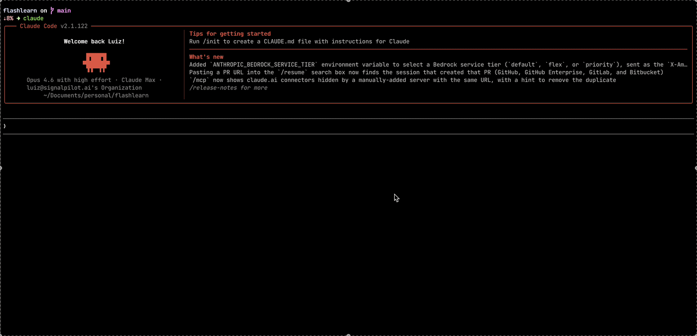

# FlashLearn

A native macOS flashcard app with spaced repetition. Study while your AI coding agent works.

FlashLearn hooks into your coding agent so it opens automatically when you send a prompt — you review flashcards during the wait, then switch back when it's done.

<p align="center">
  
</p>

## Supported Integrations

| Tool | Hook Type | Setup |
|------|-----------|-------|
| **Claude Code** | `UserPromptSubmit` (native) | `integrations/claude-code/setup.sh` |
| **OpenAI Codex CLI** | `UserPromptSubmit` (native) | [integrations/codex](integrations/codex/) |
| **Cursor** | `beforeSubmitPrompt` (native) | [integrations/cursor](integrations/cursor/) |
| **Windsurf** | `pre_user_prompt` (native) | [integrations/windsurf](integrations/windsurf/) |
| **Cline** | `UserPromptSubmit` (native) | [integrations/cline](integrations/cline/) |
| **OpenCode** | `chat.message` plugin (native) | [integrations/opencode](integrations/opencode/) |
| **Aider** | Wrapper script | [integrations/aider](integrations/aider/) |
| **VS Code** (Continue.dev, etc.) | Task + shortcut | [integrations/vscode](integrations/vscode/) |
| **Zed AI** | File watcher | [integrations/zed](integrations/zed/) |
| **Any tool** | Generic hook script | [integrations/generic-hook.sh](integrations/generic-hook.sh) |

## Install

```bash
git clone https://github.com/lfnandoo/flashlearn.git
cd flashlearn
./scripts/install.sh
```

Builds the app, copies it to `~/Applications/`, and sets up `~/.flashlearn/`.

### Quick start with Claude Code

```bash
./scripts/install.sh
./integrations/claude-code/setup.sh
```

## Launch

```bash
open -a FlashLearn
```

Or use the LaunchAgent to start on login:

```bash
cp launchd/com.flashlearn.app.plist ~/Library/LaunchAgents/
launchctl load ~/Library/LaunchAgents/com.flashlearn.app.plist
```

## Usage

### Shortcuts

| Shortcut | Action |
|---|---|
| `Ctrl+Option+Space` | Toggle FlashLearn window (global) |
| `Space` | Show answer |
| `1` | Again (reset interval) |
| `2` | Hard |
| `3` | Good |
| `4` | Easy |

### Snooze

Click the menubar icon and select a snooze duration. During snooze, hooks won't activate the app but `Ctrl+Option+Space` still works.

- 15 minutes
- 30 minutes
- 1 hour
- 2 hours
- Rest of day

### Accessibility Permission

The global shortcut requires Accessibility permission. On first launch, you'll be prompted to grant it. If not:

**System Settings > Privacy & Security > Accessibility** → add FlashLearn.

## Creating Cards

Add `.md` files to `~/.flashlearn/cards/`. Format:

```markdown
---
deck: My Deck Name
---

# Question goes here

Answer goes here. Supports **markdown**, `code`, and multiple lines.

---

# Another question

Another answer.
```

- `# heading` = front of card (the question)
- Content after heading until `---` = back of card (the answer)
- The `deck:` frontmatter is optional; defaults to the filename

### Claude Code skill

If you're using Claude Code, install the flashcard creator skill:

```bash
cp integrations/claude-code/skills/create-flashcards.md ~/.claude/skills/
```

Then use `/create-flashcards` in Claude Code to generate decks from topics, code, or conversation context.

## Sample Decks

The `sample-cards/` directory includes starter decks:

- **JavaScript Fundamentals** — 40 cards, primitives to SharedArrayBuffer
- **Node.js Fundamentals** — 40 cards, npm basics to stream backpressure
- **React Fundamentals** — 40 cards, JSX to concurrent rendering
- **System Design** — 40 cards, latency/throughput to chaos engineering

Copy them to your cards directory:

```bash
cp sample-cards/*.md ~/.flashlearn/cards/
```

## Spaced Repetition (SM-2)

Cards are scheduled using the SM-2 algorithm:

- **Again** — forgot it. Resets to 1 day interval.
- **Hard** — remembered with difficulty. Shorter interval.
- **Good** — remembered normally. Standard interval growth.
- **Easy** — remembered instantly. Longer interval.

New cards are due immediately. Review state is stored in `~/.flashlearn/reviews.json`.

## File Layout

```
~/.flashlearn/
├── cards/          # Your flashcard .md files
├── reviews.json    # SM-2 review state (auto-generated)
├── snooze          # Snooze timestamp (auto-generated)
├── pid             # Single instance lock (auto-generated)
└── scripts/
    └── flashlearn-hook.sh
```

## Build from Source

```bash
swift build              # Debug build
./scripts/build.sh       # Release build + .app bundle
```

Requires macOS 13+ with Xcode and Swift 5.8+. No external dependencies.

## Adding Support for a New Tool

If your coding agent has a "user submitted prompt" hook, point it at:

```bash
~/.flashlearn/scripts/flashlearn-hook.sh
```

The script respects snooze and handles app discovery. That's the only integration point needed.

For tools without hooks, see `integrations/generic-hook.sh` for a wrapper approach, or `integrations/aider/` for the file-watcher pattern.

PRs welcome for new integrations.
